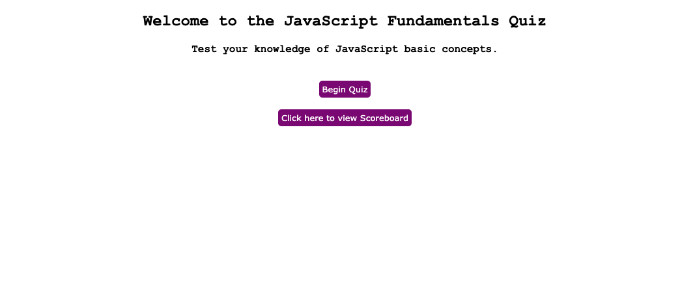

# JavaScript Code Quiz

## Project Description

My assignment was to create a timed JavaScript fundamentals quiz with specific criteria.  This included a start button to begin the timed quiz, a series of questions, a time penalty for answering a question incorrectly, and saving score information after the quiz is completed.  

### My Process/Steps

My first step was to set-up the HTML page.  I displayed a welcome message and buttons to start the quiz, as well as view the scoreboard.

Next, I worked on the JavaScript file.  I started by creating variables to connect functionality for the buttons on the HTML page.  Next, I created a series of questions with multiple choice selections.  Afterwards, I created functions to make answering each question responsive.  This included keeping score and programming the time counter to decrease by 10 seconds if a question is to be answered incorrectly.

Setting up the scoreboard functionality was next.

Lastly, I added styling to the quiz.

## Website Link

## Screenshot of Website Page

* **index**

## Author

* **Eric Donohue**
